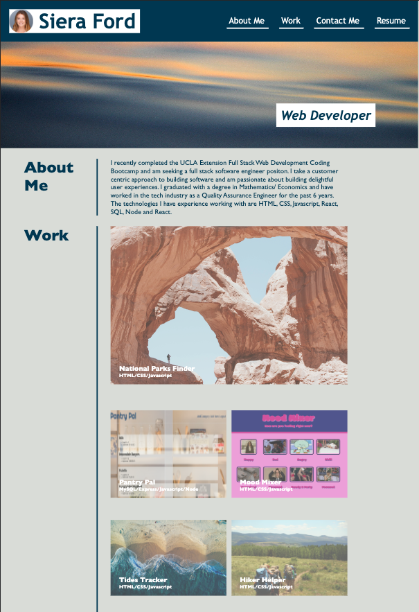

# Module 2 Challenge: Professional Portfolio

## Description

I created a professional portfolio to showcase examples of my work and accomplishments.

Click [here](https://sieraford.github.io/css-portfolio-project-siera/) to view my portfolio.

## Screenshots

## Installation

N/A

## Usage

When you visit my portfolio, you will be presented with information about me, projects I've worked on, ways to contact me and my resume. You can click the links in the navigation bar to scroll to the corresponding section.

If you click on any of the projects in the work section, you will be taken to that deployed application. You can also click on any of the links in the contact me section and it will re-direct you accordingly.

If you resize the screen or view it on a mobile device, you will be presented with a responsive layout that adapts to your screen size.

## Credits

N/A

## License

N/A
